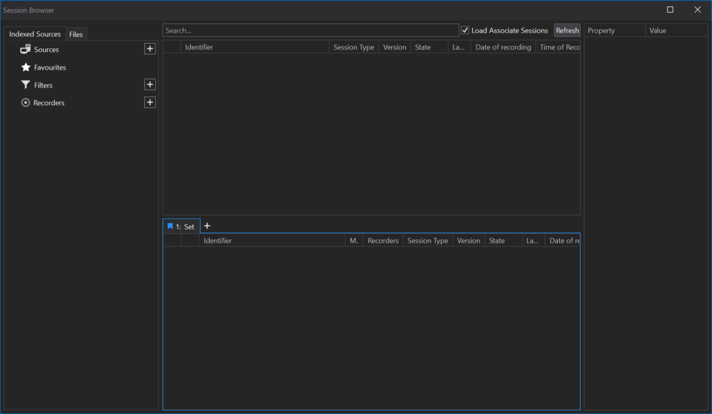
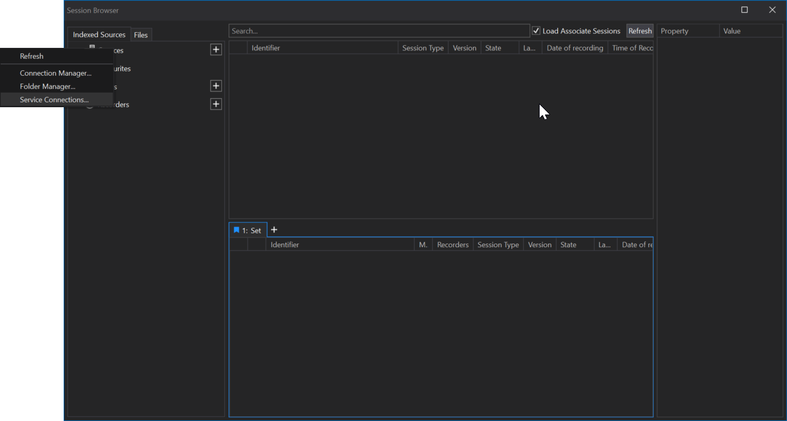
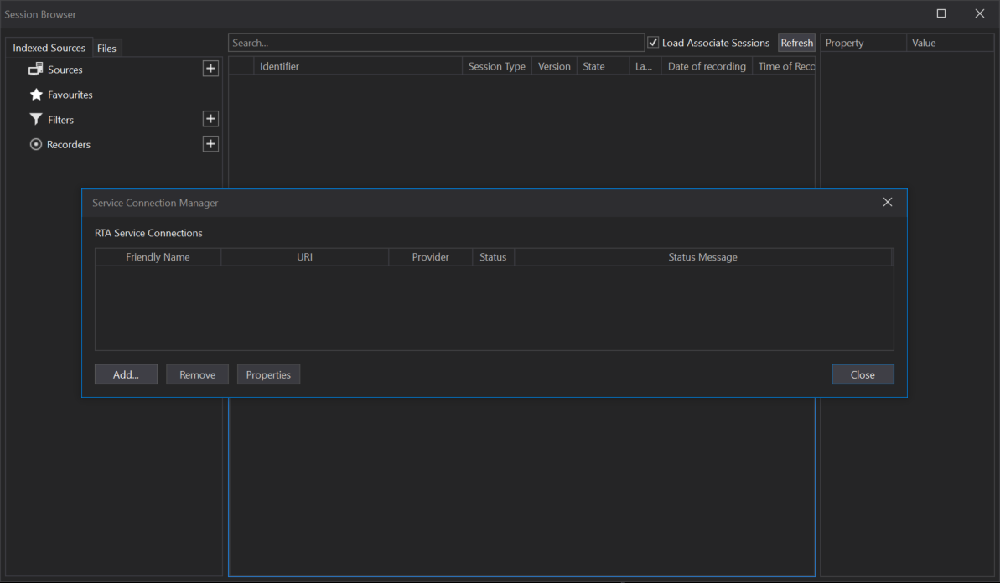
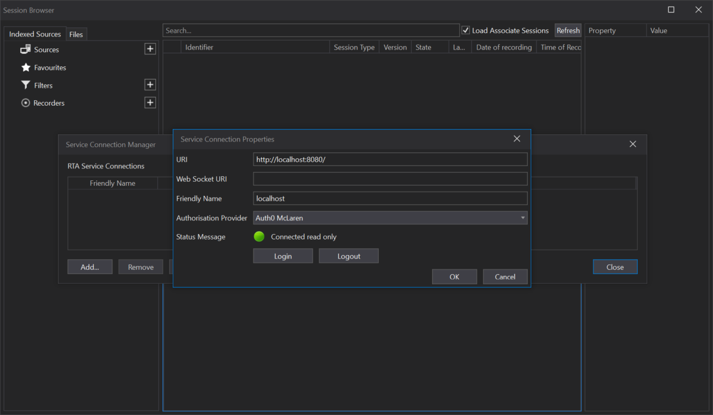
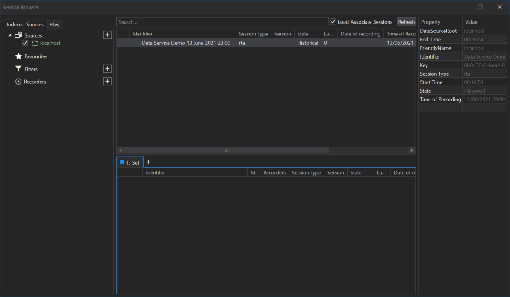
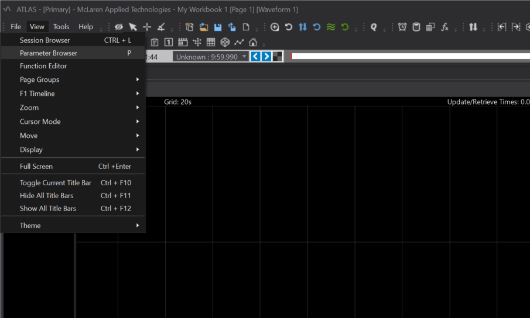
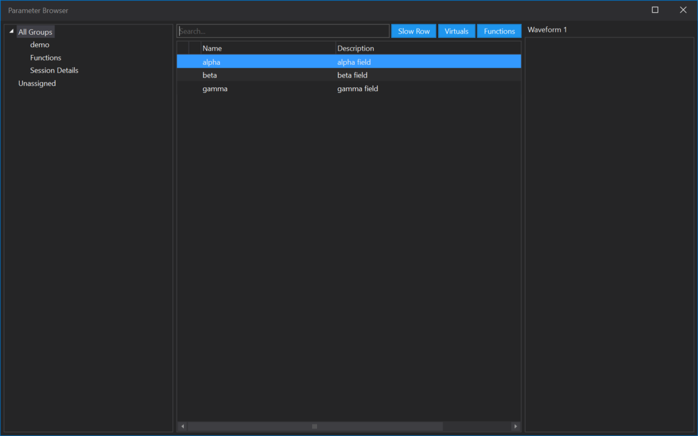
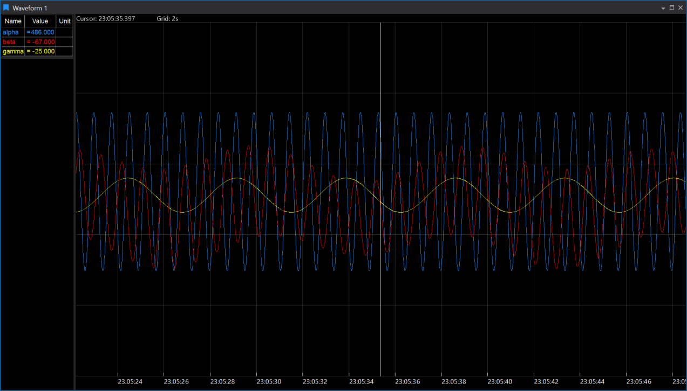

# Quick-Start &mdash; Walkthrough

This tutorial creates a simple data environment for ATLAS to connect to.

At the end, you'll have a sample data loader using functionality from McLaren's [implementation toolkit](../../../services/index.md).

In this tutorial, you:

* Setup [RTA Server](../../../services/rta-server/README.md) from the [implementation toolkit](../../../services/index.md)
* Generate and publish sample test [data](../../data/index.md), [configuration](../../configuration/index.md) and [sessions](../../sessions/index.md) using the [gRPC Services](../../../services/rta-server/grpc.md)
* Test the deployment with ATLAS

!!! tip

    These code samples are in C# for .NET 5.0, and use McLaren [NuGet packages](../../../downloads/nuget.md) to keep things as simple as possible. 

    We recommend you follow this tutorial even if you are planning to do your integration in another language.  
    The concepts should translate very easily once you have a working example.

## Prerequisites

Check out the common tutorial [prerequisites](../prerequisites.md) before you start.

You're going to need:

* [ATLAS](../prerequisites.md#atlas)
* [PostgreSQL](../prerequisites#postgresql)
* [Development Environment](../prerequisites#development-environment)

and optionally:

* [Docker](../prerequisites.md#recommended-tools)
* [grpcui](../prerequisites.md#recommended-tools)

## Step 1: Deploy [RTA Server](../../../services/rta-server/README.md)

[RTA Server](../../../services/rta-server/README.md) is designed to support early development activity.  
It provides session management, stores configuration, and can also store and serve data.

=== "Windows: Docker"

    Install [Docker Desktop for Windows](https://www.docker.com/products/docker-desktop).

    Create convenient directories to store data and configuration.

    For example:

    ```powershell

    mkdir C:\rta\configs
    mkdir C:\rta\data
    ```

    Use these paths in the command below for volume mounts (`-v`).

    This example assumes you are running PostgreSQL on your host machine, accessed through [`host.docker.internal`](https://docs.docker.com/docker-for-windows/networking/#use-cases-and-workarounds) in the connection string below.

    Update the command below with the hostname (if not `host.docker.internal`) and user/password.  
    By default, [RTA Server will initialize the database](../../../services/rta-server/#init-store) using these credentials.

    In PowerShell:

    ``` powershell hl_lines="4"
    docker run --rm `
        -v "C:\rta\configs:/data/rta-configs" `
        -v "C:\rta\data:/data/rta-data" `
        -e "RTA_PostgresConnectionString=Server=host.docker.internal;Port=5432;Database=postgres;User Id=postgres;Password=hunter2;" `
        -e "RTA_Store=File" `
        -p 8080:8080 -p 8082:8082 `
        mclarenapplied/rta-server
    ```

=== "Windows: rta-server.exe"

    If Docker is not available in your development environment, you can [download](../../../downloads/services.md#binaries) and run the service as an executable.

    Create convenient directories to store data and configuration.

    For example:

    ``` powershell

    mkdir C:\rta\configs
    mkdir C:\rta\data
    ```

    Use these paths in the command below.

    In PowerShell:

    ``` powershell
    rta-server.exe `
        --PostgresConnectionString "Server=localhost;Port=5432;Database=postgres;User Id=postgres;Password=hunter2;" `
        --Store File
        --FileConfigsPath C:\rta\configs
        --FileDataPath C:\rta\data
    ```

=== "Linux/Mac: Docker"

    Create convenient directories to store data and configuration.

    For example:

    ``` bash
    mkdir -p /tmp/rta/configs
    mkdir -p /tmp/rta/data
    ```

    Use these paths in the command below for volume mounts (`-v`).

    Update the command below with the hostname (if not `localhost`) and user/password.  
    By default, [RTA Server will initialize the database](../../../services/rta-server/README.md/#init-store) using these credentials.

    In a terminal:

    ``` bash
    docker run --rm \
        -v "/tmp/rta/configs:/data/rta-configs" \
        -v "/tmp/rta/data:/data/rta-data" \
        -e "RTA_PostgresConnectionString=Server=localhost;Port=5432;Database=postgres;User Id=postgres;Password=hunter2;" \
        -e "RTA_Store=File" \
        -p 8080:8080 -p 8082:8082 \
        mclarenapplied/rta-server
    ```

!!! notes "Docker Notes"

    The `-v` option mounts a directory on the host (left-hand-side) into a path in the container (right-hand-side).  
    The host path needs to be an absolute path.

    If you have something else running on port 8080 or 8082, you can [use Docker to change the port](https://docs.docker.com/config/containers/container-networking/).

## Step 2: Check the Service

### HTTP (port 8080)

In a web browser, go to [http://localhost:8080](http://localhost:8080)

You should see some text similar to this:

```
MAT.OCS.RTA.Toolkit.Hosts.Server 2.0.0.0
Provides RTA Toolkit services as a single deployment
    Grpc: enabled
    Data write: enabled
    Data admin: enabled

Metrics: /metrics
Health: /health
```

??? notes "Troubleshooting"

    * Is something else running on port 8080?

Also browse to [http://localhost:8080/health](http://localhost:8080/health)

This should report: `Healthy`.

If the service says it is `Unhealthy`, the console log output should say why.

??? notes "Troubleshooting"

    Possible reasons why RTA Server would report `Unhealthy`:

    * Can't communicate with PostgreSQL, or wrong PostgreSQL credentials
    * Can't find the specified directories for configs and data

### gRPC (port 8082)

Grab a copy of [grpcui](https://github.com/fullstorydev/grpcui/releases).

From a terminal:

```
grpcui -plaintext localhost:8082
```

If successful, this will open a web page where you can browse and interact with the gRPC services &mdash; which will be useful later.

??? notes "Troubleshooting"

    * Make sure you ran `grpcui` from a command prompt / terminal
    * Is something else running on port 8082?

## Step 3: Build the Demo project

### Get the sample source code

Clone the sample project from [RTA.Examples on GitHub](https://github.com/mat-docs/RTA.Examples).  
You will need a free GitHub account.

### Setup the NuGet Package feed

The McLaren GitHub site has [instructions for setting up the feed](https://github.com/mat-docs/packages) in Visual Studio.

Use your GitHub account to create a PAT (access token) with the `read:packages` permission, and [modify the `NuGet.Config` file](https://docs.github.com/en/packages/working-with-a-github-packages-registry/working-with-the-nuget-registry#authenticating-with-a-personal-access-token) in the sample project to match.

The resulting `NuGet.Config` file should look something like this:

``` xml
<?xml version="1.0" encoding="utf-8"?>
<configuration>
    <packageSources>
        <add key="mclaren" value="https://nuget.pkg.github.com/mat-docs/index.json" />
        <add key="nuget.org" value="https://api.nuget.org/v3/index.json" protocolVersion="3" />
    </packageSources>
    <packageSourceCredentials>
        <mclaren>
            <add key="Username" value="USERNAME" />
            <add key="ClearTextPassword" value="TOKEN" />
        </mclaren>
    </packageSourceCredentials>
</configuration>
```

From the terminal (or using Visual Studio), in the source code directory:

``` bash
dotnet restore
```

### Build the projects

From the terminal (or using Visual Studio), build the solution:

``` bash
dotnet build
```

??? "Troubleshooting"

    * Make sure you are in the correct directory
    * Make sure you have .NET 5.0:  
      `dotnet --version` should return something like `5.0.xxx`

## Step 4: Run the Demo

Open the solution in your development environment (e.g. Visual Studio Code).

There are several projects. You will be running `RTA.Examples.Loader`.

From the terminal, navigate to this sub-directory, and then:

``` bash
dotnet run
```

If the service has been setup correctly, this will create an example session.

You can create more sessions by running it again.

??? Troubleshooting

    * Make sure RTA Server is running
    * Make sure you're running the `RTA.Examples.Loader` project
    * If you changed the gRPC port, update the demo source code

## Step 5: Setup ATLAS

### Setup the connection

Open the ATLAS Session Browser.

Right-click on **Sources** and select **Service Connections...**

!!! info

    If you don't see this option, your ATLAS licence does not have the _RTA Data Service Connections_ feature.

    Please [Contact](https://www.mclaren.com/applied/contact/) your sales rep or McLaren Field Application Engineer.

From the **Service Connection Manager** dialog, add a new connection like this:

* **URI**: `http://localhost:8080`
* **WebSocket URI**: _(blank)_ 
* **Friendly Name**: `localhost`

Close the dialogs, and right-click **Sources** and select **Refresh**.  
The _localhost_ source should appear.

Tick the _localhost_ source and press the **Refresh** button on the right-hand-side of the dialog.  
You should see one or more sessions.

=== "Open Session Browser"

    

=== "Right-click to add Service Connection"

    

=== "Dialog"

    

=== "Add Service Connection"

    

=== "Tick Source to list sessions"

    

??? notes "Troubleshooting"

    * If the _localhost_ source is Red, maybe you mistyped the URI or the service isn't running?
    * Do you have the right version of ATLAS (see [Prerequisites](#prerequisites))?

### Test the session

Double-click to load a session.

Add a Waveform display, and press `P` to add parameters using the _Parameter Browser_ by double-clicking or dragging.

You should see waveform traces.

=== "Open Parameter Browser"

    

=== "Add Parameters to Waveform"

    

=== "Waveform display"

    

## Next Steps

[Review the sample project](review.md) to understand how each routine contributes to the demo integration.

You can use this project to experiment with RTA features in this documentation.
